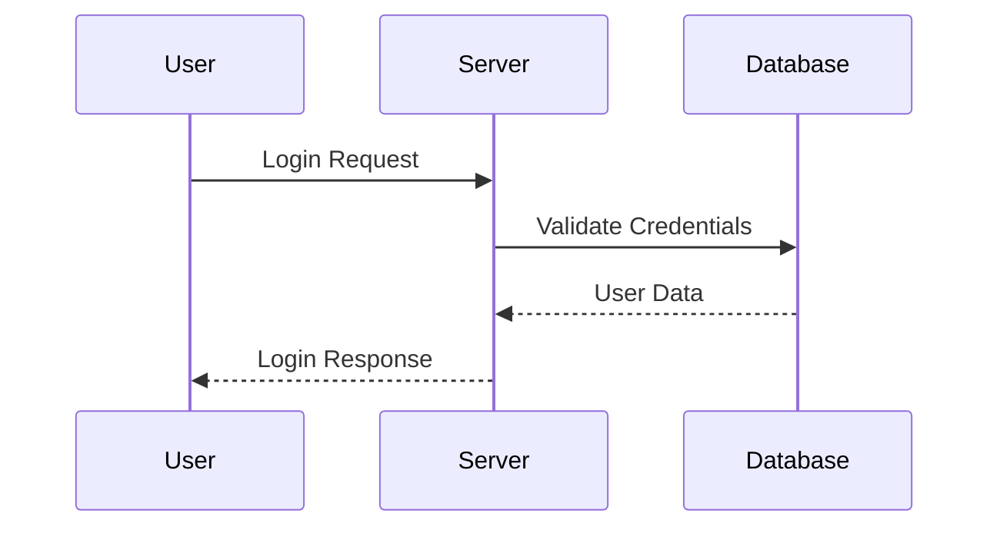
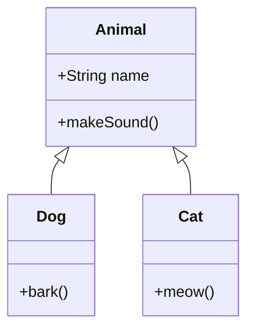
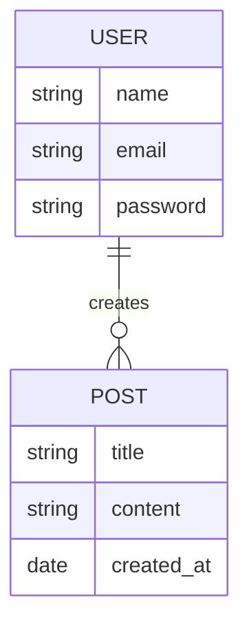
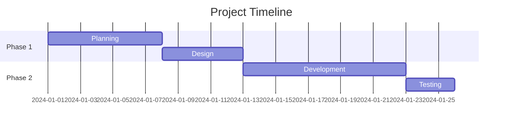

# Diagrams

## Overview

Diagrams can be created in markdown using various diagramming tools and syntaxes, with Mermaid being the most popular.

## Types of Diagrams

### Sequence Diagrams

### Class Diagrams

### Entity Relationship Diagrams

### Gantt Charts

## Best Practices

- Choose the right diagram type for your content
- Keep diagrams simple and focused
- Use consistent naming conventions
- Test diagrams in your target platform
- Provide alternative text descriptions
- Update diagrams when code changes

---

**[← Back to Markdown Guide](../MARKDOWN.md)**
