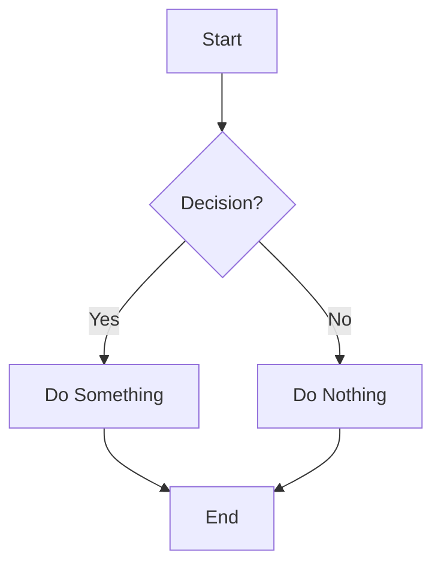
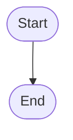
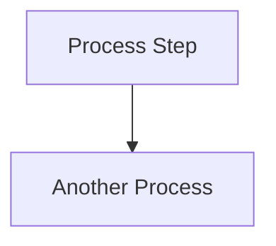
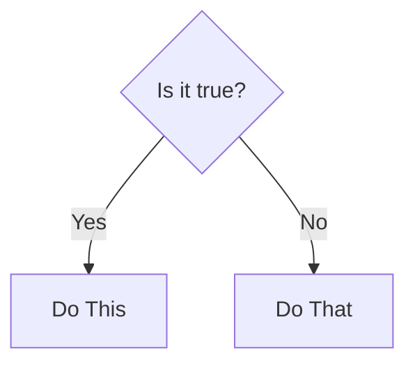
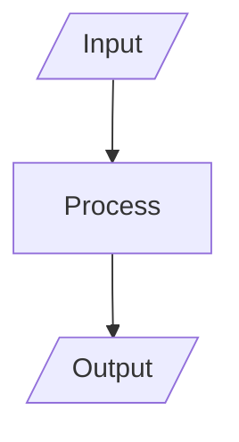
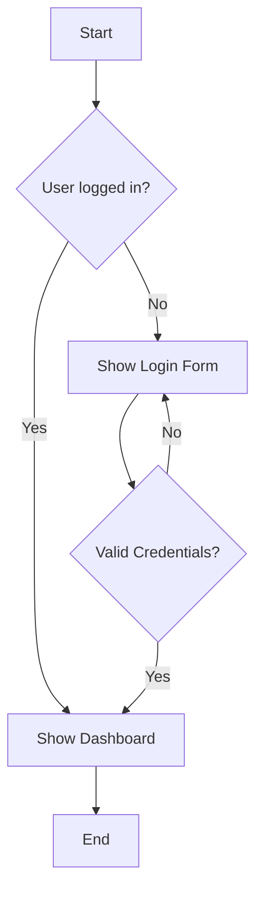

# Flowcharts

## Overview

Flowcharts can be created in markdown using Mermaid syntax, which is supported by many platforms including GitHub and GitLab.

## Basic Syntax

Use Mermaid code blocks:

```markdown

```

## Common Elements

### Start/End



### Process



### Decision



### Input/Output



## Example Flowchart



## Best Practices

- Keep flowcharts simple and readable
- Use descriptive labels
- Maintain consistent styling
- Test your flowchart in the target platform
- Use appropriate shapes for different types of elements
- Consider the flow direction (TD = top-down, LR = left-right)

---

**[← Back to Markdown Guide](../MARKDOWN.md)**
